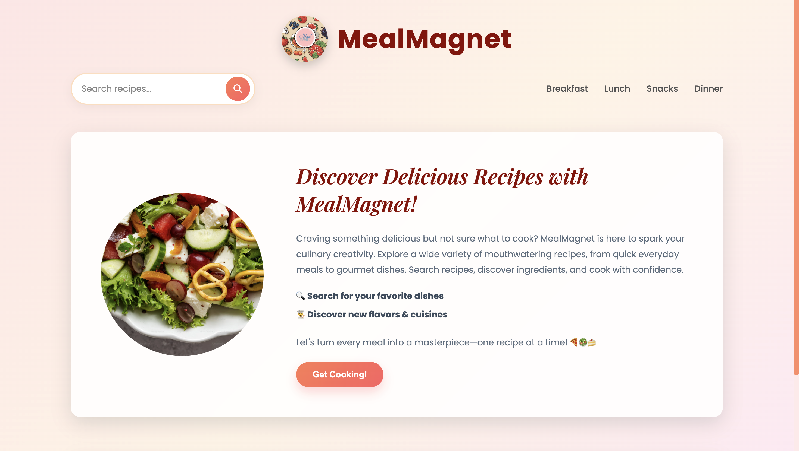
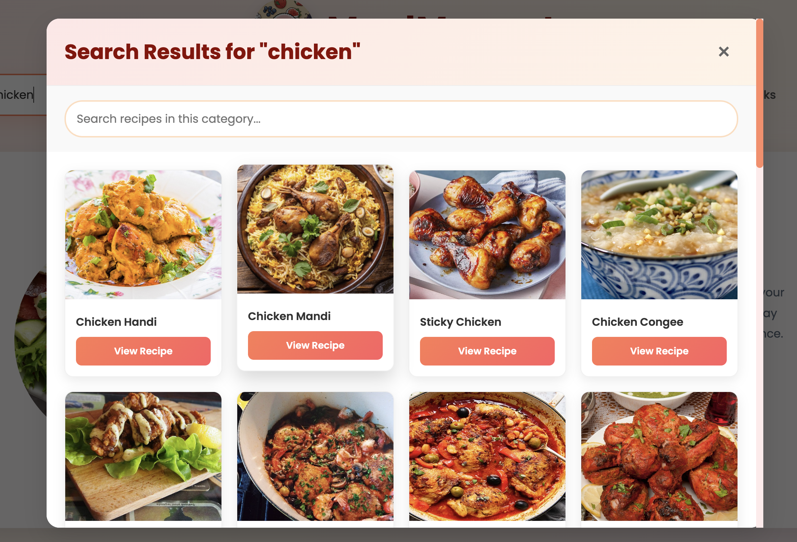
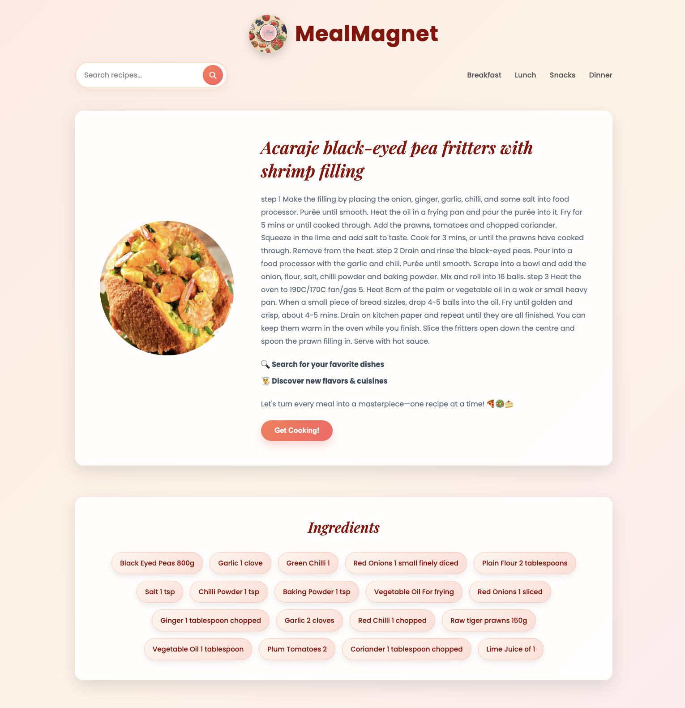

# 🍽️ MealMagnet

A responsive recipe discovery web application built with **HTML, CSS, and JavaScript** that allows users to search for recipes, explore ingredients, and view detailed cooking instructions using the **TheMealDB API**.

---

## 📸 Preview

| Home Page | Search Results |
|------------|----------------|
|  |  |

| Recipe Details |
|----------------|
|  |

---

## ✨ Features

- Search recipes by name
- View detailed recipe information
- Display ingredients with measurements
- Step-by-step cooking instructions
- Live recipe data from TheMealDB API
- Fully responsive design
- Graceful handling of invalid searches
- Modern and clean user interface

---

## 🛠️ Tech Stack

| Technology | Usage |
|------------|-------|
| HTML5 | Page Structure |
| CSS3 | Styling & Responsive Design |
| JavaScript (ES6+) | Application Logic |
| Fetch API | API Requests |
| Font Awesome | Icons |
| Google Fonts | Typography |
| TheMealDB API | Recipe Data |

---

## 📂 Project Structure

```text
MealMagnet/
│
├── assets/
│   └── images/
│       └── logo.png
│
├── css/
│   └── style.css
│
├── js/
│   └── app.js
│
├── screenshots/
│
├── index.html
└── README.md
```

---

## 🚀 Getting Started

Clone the repository

```bash
git clone https://github.com/aditisonkar12/MealMagnet.git
```

Move into the project

```bash
cd MealMagnet
```

Open `index.html` in your browser

or

Use the **Live Server** extension in VS Code.

---

## 🌐 API

MealMagnet uses the free **TheMealDB API** to fetch recipe data in real time.

**Endpoints Used**

- `/search.php?s=` — Search meals by name

---

## 💡 Challenges

While building MealMagnet, I focused on:

- Integrating a REST API using Fetch API and async/await
- Dynamically updating the DOM based on user input
- Parsing and displaying ingredients efficiently
- Handling invalid searches gracefully
- Building a responsive interface for different screen sizes

---

## 📚 What I Learned

This project helped me strengthen my understanding of:

- JavaScript ES6+
- Async/Await
- REST APIs
- Fetch API
- DOM Manipulation
- Responsive Web Design
- Error Handling
- Frontend Project Organization

---

## 🚀 Future Improvements

- Favorite recipes
- Random recipe generator
- Dark mode
- Search suggestions
- Recent searches
- Filter recipes by cuisine
- Share recipes

---

## 👩‍💻 Author

**Aditi Sonkar**

GitHub: https://github.com/aditisonkar12

---

## 🙏 Acknowledgements

- **TheMealDB** for providing the recipe API
- **Font Awesome** for icons
- **Google Fonts** for typography

---

⭐ If you like this project, consider giving it a star!